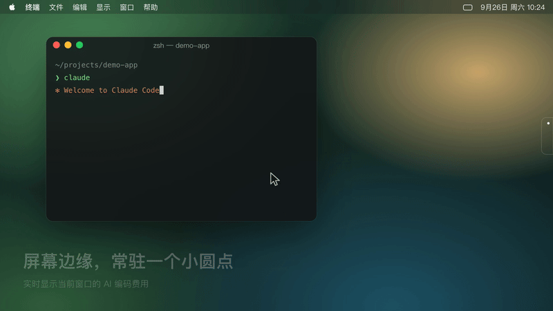

# nootch · Vibe Usage 版

> 在 Mac 屏幕边缘常驻一个小圆点，随时告诉你：**今天的 AI 编码用量** —— 花了多少钱、用了多少 token、跑了几个 session、哪些模型用得最多。


[](docs/media/nootch-promo.mp4)

<sub>▶ 点击动图观看完整宣传视频（[MP4](docs/media/nootch-promo.mp4)）</sub>

## 二次开发声明

本项目是 [DeepanshuMishraa/nootch](https://github.com/DeepanshuMishraa/nootch) 的**二次开发版本（fork）**，感谢原作者 DeepanshuMishraa 开源了这样一个优雅的小工具 —— 全部的 UI 框架（边缘悬浮面板、液态玻璃主题、悬停详情卡、设置窗口）都来自原项目。

数据来源基于 [vibe-cafe/vibe-usage](https://github.com/vibe-cafe/vibe-usage)（[vibecafe.ai](https://vibecafe.ai)），感谢 VibeCafé 团队提供的用量统计服务和开放 API。

### 与原版有什么区别

| | 原版 nootch | 本 fork |
|---|---|---|
| 数据源 | 11 个 AI provider 的订阅配额窗口 | 只保留 **Vibe Usage** 一个数据源 |
| 展示内容 | 各家配额剩余百分比 | **可选窗口用量**（今日 / 24h / 近 7 天 / 近 30 天）：费用 / tokens / sessions / 活跃时长 / Top 模型 |
| 凭证读取 | 读 macOS 钥匙串（会弹密码授权框） | 只读 `~/.vibe-usage/config.json`，**零钥匙串访问、零弹窗** |
| 网络请求 | 轮询各家配额 API | 每 30s 读一次云端用量 + 每 30min 上传一次本地解析结果 |

## 工作原理

```
你的 AI 工具日志 (Claude Code / Codex / Kimi Code / Grok / Pi)
        │  nootch 内置同步引擎本地解析（不上传消息内容，只报 token 计数）
        ▼
   vibecafe.ai 云端聚合
        │  nootch 每 30s 读取 (Bearer token, 只读)
        ▼
   屏幕边缘的今日用量圆点 + 悬停详情
```

**v1.2.0 起，nootch 内置了完整的同步引擎**（vibe-usage 官方协议的 Swift 原生实现）：启动后自动解析本地日志并每 30 分钟上传到 vibecafe.ai，**不需要安装 Node.js，不需要跑任何额外的 App 或后台服务**。只装这一个 App 就是完整闭环。

- 支持解析：Claude Code、Codex、Kimi Code、Grok、Pi（Oh My Pi）
- 与官方 `vibe-usage` CLI 共用 `~/.vibe-usage/state.json` 增量状态格式，无缝接管已有数据，不会重复计数（服务端按 bucket 幂等 upsert）
- 上传前会读取你在 vibecafe.ai 的隐私设置（是否上传项目名），消息内容永不离开本机
- 设置里可关闭「Vibe Usage 自动同步」（只读展示，不上传）

## 安装

要求：Apple Silicon Mac，macOS 15 Sequoia 或更新。

**第一步：配置 vibe-usage**（只需一次，仅用于获取 API key）

```sh
npx @vibe-cafe/vibe-usage
```

按提示在浏览器完成授权即可，它会把 API key 写入 `~/.vibe-usage/config.json`。**之后就不再需要 Node 或 vibe-usage 了**，同步由 nootch 内置引擎完成。

已在用 vibe-usage daemon / Mac App 的用户：nootch 会直接接管（共用增量状态，不会重复计数），可以把它们卸掉：

```sh
vibe-usage daemon uninstall   # 如果装过 daemon 的话
```

**第二步：安装 nootch**

从 [Releases](https://github.com/xiaoan17/nootch/releases/latest) 下载 DMG，拖入「应用程序」。

首次打开如果被 Gatekeeper 拦截（本应用为 ad-hoc 签名、未公证），执行：

```sh
xattr -dr com.apple.quarantine /Applications/nootch.app
open -a nootch
```

也可以用 Homebrew：

```sh
brew tap xiaoan17/nootch https://github.com/xiaoan17/nootch
brew install --cask xiaoan17/nootch/nootch
```

## 使用

- 把鼠标移到**屏幕右缘 / 左缘**（可在设置里改到底部居中），面板就会滑出
- 圆点上直接显示**当前窗口费用**（如 `$82.2`），窗口可在设置里切换（默认今日，可选 24h / 近 7 天 / 近 30 天）
- **悬停圆点**展开详情卡：总费用、总 tokens、session 数、活跃时长、Top 5 模型费用明细
- **直接按住面板拖动**即可调整位置：左右边缘模式上下移动，底部模式左右移动；松手后自动保存
- 设置窗口里可调整位置、外观、主题色、**费用窗口范围**等

### 保持数据新鲜

v1.2.0 起无需任何额外组件——nootch 运行期间每 30 分钟自动解析本地日志并同步。命令行手动触发（调试用）：

```sh
/Applications/nootch.app/Contents/MacOS/nootch --vibe-sync          # 立即同步
/Applications/nootch.app/Contents/MacOS/nootch --vibe-sync-dry-run  # 只算差异不上传
```

## 更新日志

| 版本 | 主要变化 |
|---|---|
| 未发布 | 同步原项目上游修复：资源包查找不再依赖 `Bundle.module`（缺资源时降级而不是崩溃）；打包脚本强制校验资源包、去掉 `--deep`、支持 `CODESIGN_IDENTITY` 正式签名并在签名后校验 |
| v1.3.4 | 统一 App 图标加载；图标文件名带内容哈希，升级后 Dock 不再显示旧图标 |
| v1.3.3 | 去掉详情卡阴影 |
| v1.3.2 | 面板支持直接拖动调整位置；去掉外层阴影 |
| v1.3.1 | 新仓鼠图标，内置 macOS 圆角遮罩 |
| v1.3.0 | 费用窗口可选：今日 / 24h / 近 7 天 / 近 30 天 |
| v1.2.0 | 内置 vibe-usage 同步引擎，不再需要 Node.js 或后台 daemon |

## 从源码构建

需要 Xcode Command Line Tools 和 Swift 6：

```sh
git clone https://github.com/xiaoan17/nootch.git
cd nootch
swift run nootch          # 直接运行
Tools/test.sh             # 跑测试（兼容独立 Command Line Tools 的 Swift Testing 路径）
packaging/build-app.sh    # 打出 .app 和 DMG（在 dist/）
```

`packaging/build-app.sh` 默认使用 ad-hoc 签名。有 Developer ID 证书时可以指定签名身份，获得跨版本稳定的签名：

```sh
CODESIGN_IDENTITY="Developer ID Application: Your Name (TEAMID)" packaging/build-app.sh
```

打包时如果缺少 `nootch_Nootch.bundle` 资源包会直接失败，避免发出没有 logo / 图标的 DMG。

宣传视频的源码在 `Tools/promo/`，可以重新渲染 `docs/media/` 下的视频和动图；`node Tools/promo/og.mjs` 生成社交分享图（`og-image.png` 1200×630、`social-preview.png` 1280×640）。

`Tools/test.sh` 会检测当前开发工具目录，为部分独立 Command Line Tools 版本补上 Swift Testing 的框架和运行库搜索路径；不修改系统工具链。可以透传测试参数，例如 `Tools/test.sh --filter VibeUsage`。完整 Xcode 等其他环境会直接使用 `swift test`。

## 致谢 / References

- [DeepanshuMishraa/nootch](https://github.com/DeepanshuMishraa/nootch) — 原项目，全部 UI 与面板框架
- [vibe-cafe/vibe-usage](https://github.com/vibe-cafe/vibe-usage) — 用量数据解析、同步与 API
- [vibecafe.ai](https://vibecafe.ai) — 用量看板与数据服务
- [@luisKisters](https://github.com/luisKisters) — 上游 PR #2（资源包查找与签名修复），已同步到本 fork

---

## English

A derivative fork of [nootch](https://github.com/DeepanshuMishraa/nootch) (all UI credit goes to the original author) that drops every provider integration except one: it shows **today's AI coding usage** from [vibecafe.ai](https://vibecafe.ai) — cost, tokens, sessions, active time, and top models — in the same lovely always-on-top screen-edge overlay. Since v1.2.0 it also embeds a Swift-native reimplementation of the [vibe-usage](https://github.com/vibe-cafe/vibe-usage) sync protocol, parsing local Claude Code / Codex / Kimi Code / Grok / Pi logs and uploading token counters every 30 minutes — no Node.js, no separate daemon, one app is the whole loop. It never touches the macOS Keychain (no password prompts) and never uploads message content. Run `npx @vibe-cafe/vibe-usage` once to obtain an API key, then install the DMG from Releases. A short promo video lives at [`docs/media/nootch-promo.mp4`](docs/media/nootch-promo.mp4).
